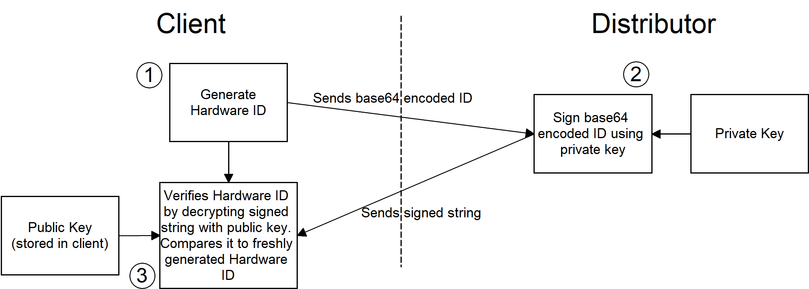

# Simple Licensing
This is a simple licensing demo I might use for future closed source projects of mine. 

The first step is to generate a hardware ID based on the users system. This includes data on his gpu, ram, cpu and motherboard. 
Depening on frequent system changes I might add or remove factors in the future.

In step two the hardware ID is then sent to me where I sign it with my private RSA certificate. 
By signing it I am indicating that this PC is allowed to use my software, this cannot be reversed. 
Then I sent the signed string, basically the license, back to the user.

Step three occurs when the user enters the license into his software and everytime he starts the program.
The public key has been built into the software and the hardware ID is reproduceable. 
When the user enters his license the client verifies it by comparing it to a freshly generated hardware ID with the public key. 
If they match the user will be allowed to use the software, otherwise the software will close and require the input of a new license.

  

## Problems
1. Hardware changes - Users tend to change their hardware, maybe change some ram or the gpu. After such a hardware change the hardware ID won't be the same and cannot be verified. An easy solution to this is telling users to contact me when a hardware change occurs.
2. Decompile Recompile - Software like ILSpy offers decompilation into a `.csproj` experienced users could easily recompile it with their own public key / without any license checks and use as well as spread the software without the need for licenses. At the moment I don't have a solution to this problem.
